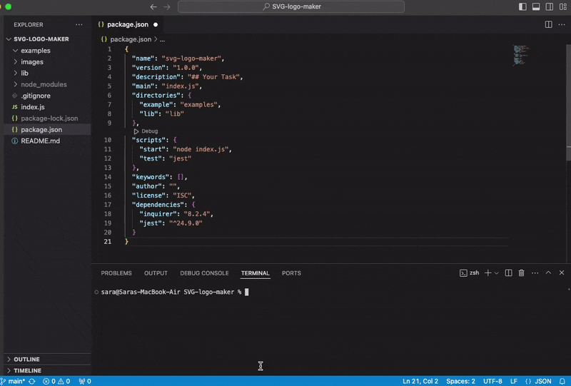

# SVG Logo Maker

## Description

This Node.js command-line application that takes in user input to generate a logo and save it as an [SVG file](https://en.wikipedia.org/wiki/Scalable_Vector_Graphics). The application prompts the user to select a color and shape, provide text for the logo, and save the generated SVG to a `.svg` file.

## Installation

To clone and run this repository you'll need Git and Node.js (which comes with npm) installed on your computer. From your command line:
```
# Clone this repository
git clone git@github.com:Saraz-Git/SVG-logo-maker.git

# Go into the repository
cd SVG-logo-maker

# Install dependencies
npm i

# Run the app
npm start
```
## Usage

The following image shows the application's appearance and functionality:



The following image shows a mock-up of the generated SVG given the following input entered by the user: `SVG` for the text, `white` for the text color, `circle` from the list of shapes, and `green` for the shape color. Note that this is just an image of the output SVG and not the SVG file itself:


## Features

```md
GIVEN a command-line application that accepts user input
WHEN I am prompted for text
THEN I can enter up to three characters
WHEN I am prompted for the text color
THEN I can enter a color keyword (OR a hexadecimal number)
WHEN I am prompted for a shape
THEN I am presented with a list of shapes to choose from: circle, triangle, and square
WHEN I am prompted for the shape's color
THEN I can enter a color keyword (OR a hexadecimal number)
WHEN I have entered input for all the prompts
THEN an SVG file is created named `logo.svg`
AND the output text "Generated logo.svg" is printed in the command line
WHEN I open the `logo.svg` file in a browser
THEN I am shown a 300x200 pixel image that matches the criteria I entered
```
## Tests

This application use [Jest](https://www.npmjs.com/package/jest) for running the unit tests and [Inquirer](https://www.npmjs.com/package/inquirer/v/8.2.4) for collecting input from the user. The test file will be invoked by using the following command:

```bash
npm run test
```
Each shape class is tested for a `render()` method that returns a string for the corresponding SVG file with the given shape color.

The following example test should pass:

```js
const shape = new Triangle();
shape.setColor("blue");
expect(shape.render()).toEqual('<polygon points="150, 18 244, 182 56, 182" fill="blue" />');
```

## File Structure

```md
.  
├── examples/           // Example svg file(s) created with the app
├── lib/                // Folder for classes or functions
    ├── shapes.js       // Exports `Triangle`, `Circle`, and `Square` classes
    ├── shapes.test.js  // Jest tests for shapes
    └── more...         // Additional files and tests
├── .gitignore          // Indicates which folders and files Git should ignore
├── index.js            // Runs the application using imports from lib/
├── package.json
└── README.md           // App description, link to video, setup and usage instructions           
```
## SVG Reference

* [Example SVG](https://static.fullstack-bootcamp.com/fullstack-ground/module-10/circle.svg)

* [Scalable Vector Graphics (SVG)](https://en.wikipedia.org/wiki/Scalable_Vector_Graphics)

* [SVG tutorial](https://developer.mozilla.org/en-US/docs/Web/SVG/Tutorial)

* [Basic SVG shapes](https://developer.mozilla.org/en-US/docs/Web/SVG/Tutorial/Basic_Shapes)

* [Text in SVG](https://developer.mozilla.org/en-US/docs/Web/SVG/Tutorial/Texts)

* [SVG VS Code extension](https://marketplace.visualstudio.com/items?itemName=jock.svg)

## Review

* A walkthrough video that demonstrates the functionality of the application and passing tests: [video](https://www.loom.com/share/bc8053e6cb744afeafae14c943a66197)

* Sample SVG files generated using this application in the examples folder.

* The URL of the GitHub repository: https://github.com/Saraz-Git/SVG-logo-maker

